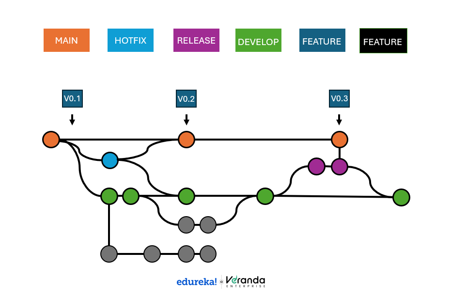

# Git Branching Strategy

This document defines the branching strategy for our team-based development project.  
It ensures efficient collaboration, performance optimization, and stable releases.

---

## 📌 Branch Overview

- **main**  
  - Stable production-ready branch.  
  - Direct commits are **not allowed**.  
  - Only `release/*` and `hotfix/*` branches merge into `main`.  
  - Protected with GitHub settings:
    - Requires pull request reviews before merging.  
    - Requires all CI/CD checks (tests, linting, performance benchmarks) to pass.  
    - Restricted push access to maintainers/admins.  

- **develop**  
  - Integration branch for staging new features and performance improvements.  
  - All `feature/*` and `performance/*` branches are created from `develop`.  
  - Pull requests into `develop` must:
    - Pass automated tests and linting checks.  
    - Receive at least one reviewer approval.  
  - Serves as the base for creating `release/*` branches.  
  - Protected with GitHub settings:
    - Requires pull request reviews before merging.  
    - Requires status checks to pass.  
    - Restricted direct pushes to maintainers.  

- **feature/***  
  - Used for developing new features.  
  - Created from `develop`.  
  - Merged back into `develop` after review and testing.  

- **performance/***  
  - Dedicated branches for performance optimization tasks.  
  - Created from `develop`.  
  - Merged back into `develop` after validation.  

- **release/***  
  - Created from `develop` when preparing a new release.  
  - Used for final bug fixes, documentation, and performance checks.  
  - Merged into both `main` and `develop`.  

- **hotfix/***  
  - Created directly from `main` to fix urgent production issues.  
  - Merged back into both `main` and `develop` to keep branches consistent.  

---

## 🔒 Rules Enforced by GitHub Settings

- **Protected Branches**: `main` and `develop` cannot be pushed to directly.  
- **Pull Requests**: All merges require PRs with at least one reviewer approval.  
- **Status Checks**: CI/CD pipelines must pass before merging.  
- **Branch Naming**: Branches must follow prefixes:  
  - `feature/*`  
  - `performance/*`  
  - `release/*`  
  - `hotfix/*`  

---

## 📊 Branching Diagram

## ✅ Workflow Summary

1. Create a `feature/*` or `performance/*` branch from `develop`.  
2. Commit changes and open a Pull Request into `develop`.  
3. When stable, create a `release/*` branch from `develop`.  
4. Merge `release/*` into both `main` and `develop`.  
5. For urgent fixes, create a `hotfix/*` branch from `main` and merge back into both `main` and `develop`.  

---

📖 This strategy ensures **stable production**, **efficient collaboration**, and **performance optimization** across the team.
